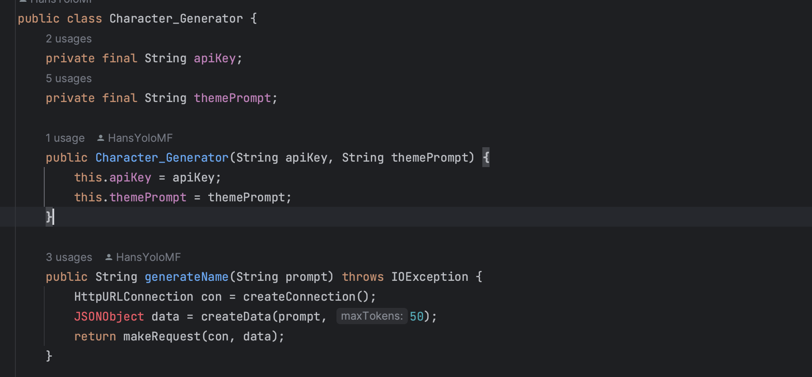

# GenShi

Problem Domain:

The problem domain our group would like to focus on is simple gaming. Some basic knowledge of gaming would be required to understand the project. 

Our Application:

Our team would like to develop a game which is based on luck mostly. It is a one player game against the computer where the characters are assigned randomly. Each character has certain statistics which make them stronger or weaker than the computers'. The more games you win against the computer, the more of the character cards you get in your bounty. However, this depends entirely on the stats of your randomly assigned card. The aim of this game is for the user to get all the cards in the system, possibly before the computer does.

We aim to use two API's to make this possible:

1. OPENAI API (GPT and DALL - E)
    https://platform.openai.com/docs/introduction/overview

   We believe GPT will be useful for the random generation of stats and general randomness of our game. DALL- E will be useful for generating images of our randomised playable characters.

2. Google
   https://developers.google.com/explorer-help

   We wanted to embed this in the user sign up/login part of our game. However this is not an api that requires focus for our problem domain and general idea. We just thought to add it as part of our plan in the future. Our project relies more on (1)

Here are some screenshots of us trying out some OpenAi requests on https://hoppscotch.io/:

Here is the main java code that generates the stats we need for our randomised characters using GPT:

 

However, it is not very obvious that it is using the api, so here is the body of one of the helper methods used within called "generate name" (along with some other details above that we thought were useful to belabour showing the use of the api)

  

The result of this call is a huge txt files of different characters,descriptions and stats as seen below:

![py_files/images/Screenshot 2023-10-01 at 8.20.47 PM.png]

These are alot, so an example of one of the characters in the txt file is shown below for clarity:

As for our image generation from openai, here is some code written to get the character image player cards using dall-e.

However, another constraint that we noticed was that dall-e was not very good at reading prompts. It gave low quality ai images such as the one below:

However, to show our idea better, we used a local image generation ai instead. We will document this better in our techincal contraints part.

Our ideal result of the image api we would like to use would be something like this:

 

(gotten from SDXL. https://stablediffusionxl.com/)

We noticed somethings that may be a technical constraint:
1. We needed to generate several images. However, many image apis would restrict us to the number of calls we could make. If we wanted to make more calls, we had to pay a fee.
   We decided to go with DALL-E for now to visualise our idea. However, help in this area would be greatly appreciated.
2. We needed a smarter AI Api to really make our idea shine through. Again, help would be appreciated here. SDXL was very receptive to the openai prompts.

   
   
   

